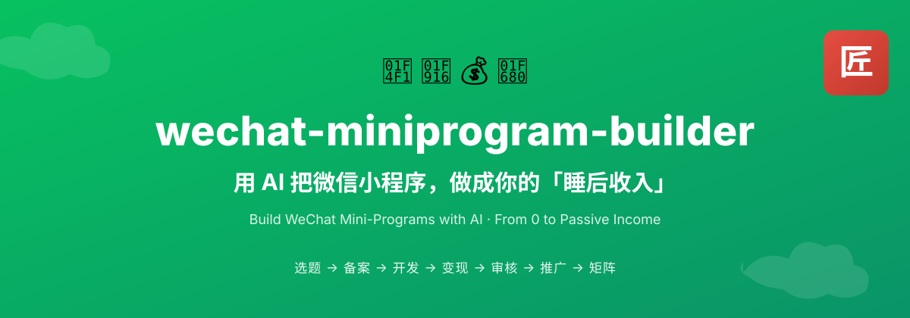
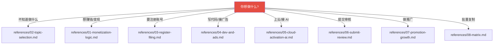
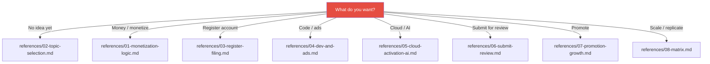

<p align="center">
  
</p>

<p align="center">
  
  
  
  
  
</p>

<p align="center">
  <a href="#中文说明">🇨🇳 中文</a> &nbsp;|&nbsp; <a href="#english">🇺🇸 English</a>
</p>

---

<span id="中文说明"></span>

# 🇨🇳 中文说明

> ## 用 AI 把微信小程序，做成你的「睡后收入」
> 一份**工具无关的 AI 方法论**（见 `UNIVERSAL.md`），给任意 AI 助手当「程序化工作流」使用，覆盖：**选题 → 备案 → 开发 → 变现 → 审核 → 推广 → 矩阵** 全生命周期。
> 适用于 Cursor、Claude、Claude Code、Cline、通义灵码、CodeBuddy、ChatGPT 自定义指令、WorkBuddy 等任何支持项目上下文 / 系统指令的 AI 工具。

## 💬 加入 AI 破局社群

<h1 align="center"><b>想要加入自媒体 AI 破局社群可联系微信：JZX_AI1203</b></h1>

---

## 📖 目录

- [它能帮你做什么](#-它能帮你做什么)
- [全生命周期流程图](#-全生命周期流程图)
- [快速开始](#-快速开始)
- [决策树：该读哪一份](#-决策树该读哪一份)
- [目录结构](#-目录结构)
- [合规红线](#-合规红线)
- [贡献 / Roadmap / 致谢](#-贡献--roadmap--致谢)
- [License](#-license)

## ✨ 它能帮你做什么

| 🚀 能力 | 💡 说明 |
|---|---|
| **全生命周期覆盖** | 从「我想做个小程序」到「矩阵化批量运营」，一个不漏 |
| **程序化决策树** | 你说一句需求，AI 自动加载对应阶段的方法论 |
| **即取即用的模板** | 万能提示词、上线检查清单、小红书笔记模板，复制就能用 |
| **合规红线内建** | 激活码违规、个体主体限制、不承诺收益，关键雷区已标红 |

## 🗺️ 全生命周期流程图


## 🚀 快速开始（任何 AI 工具都行）

本仓库**不绑定任何单一工具**。任选一种方式接入：

**① 任意 AI 工具（通用，推荐）**

把整个仓库作为**项目上下文 / 系统指令**提供给你的 AI，让它阅读 `UNIVERSAL.md` 与对应 `references/*.md` 即可：

> 「先读 `UNIVERSAL.md` 和 `references/02-topic-selection.md`，帮我想 5 个适合个人开发者做的小程序方向。」

适用工具（不限于）：Cursor、Claude、Claude Code、Cline、通义灵码、CodeBuddy、ChatGPT 自定义指令、WorkBuddy 等。

**② WorkBuddy 用户（可选集成）**

若你使用 WorkBuddy，可把整个文件夹复制到 `~/.workbuddy/skills/wechat-miniprogram-builder/`，重启后即作为 Skill 自动触发；其余 AI 工具直接用 ① 即可，无需此步。

## 🧭 决策树：该读哪一份



## 📦 目录结构

```
wechat-miniprogram-builder/
├── SKILL.md                      # WorkBuddy 专用入口（含触发元数据）
├── UNIVERSAL.md                  # 工具无关版，供其他 AI 工具使用
├── README.md                     # 本文件（中英双语）
├── LICENSE                       # MIT
├── assets/                       # 视觉资产 + 交付物模板
│   ├── banner.svg                # Hero Banner（国风社区风）
│   ├── badges/                   # 离线 SVG 徽章（MIT / 8阶段 / 微信 / AI / 更新）
│   ├── prompt-recipes.md         # 万能提示词模板 + 各类型示例
│   ├── release-checklist.md      # 上线前检查清单
│   └── xhs-note-templates.md     # 小红书笔记模板
├── references/                   # 按阶段拆分的详细方法论
│   ├── 01-monetization-logic.md  # 变现逻辑：广告 vs 订阅 vs 激活码
│   ├── 02-topic-selection.md     # 选题与需求判断
│   ├── 03-register-filing.md     # 注册、备案、认证、个人 vs 企业
│   ├── 04-dev-and-ads.md         # 开发流程、提示词写法、广告变现
│   ├── 05-cloud-activation-ai.md # 云开发 / 激活码(已违规) / AI 接入(需企业)
│   ├── 06-submit-review.md       # 上传、审核、被拒修复
│   ├── 07-promotion-growth.md    # 小红书冷启动与增长
│   └── 08-matrix.md              # 矩阵化运营
```

## ⚠️ 合规红线

> ⚠️ **请务必读完再动手**，以下雷区踩中会被下架甚至封号：

1. **平台规则会变**：微信类目、流量主门槛、广告能力、API 权限以官方最新文档为准。
2. **不承诺收益**：本仓库所有收入、UV、eCPM、案例均作参考，不构成任何收益承诺。
3. **激活码模式已违规**：原教程 2026/4/21 标注激活码方式存在违规，仅作学习引导，**请勿上线**；付费请走企业/个体户主体 + 微信官方支付。
4. **个体主体限制**：个人主体无法接入微信支付，程序内直接调用 AI 能力通常审核不过（需企业资质）。
5. **密钥安全**：AppSecret / API Key / 云环境密钥仅存于环境变量或密钥管理器，勿写入公开仓库。

本仓库内容仅供学习交流。请遵守微信公众平台运营规范与所在国家/地区法律法规。

## 🤝 贡献 / Roadmap / 致谢

- **贡献**：欢迎提 Issue / PR，补充新类目、新提示词或更优的审核话术。
- **Roadmap**：更多平台（抖音小程序 / 支付宝小程序）、视频号联动、自动化脚本。

## 📄 License

[MIT](./LICENSE) —— 自由使用、修改、再分发，注明出处即可。

---

<span id="english"></span>

# 🇺🇸 English

> ## Build WeChat Mini-Programs with AI · From 0 to Passive Income
> A programmatic workflow written for the **AI assistant**, covering the full lifecycle:
> **Topic Selection → Filing → Development → Monetization → Review → Promotion → Matrix**.
> Both a **WorkBuddy Skill** and a **tool-agnostic AI methodology** (see `UNIVERSAL.md`) — works with Cursor / Claude / Cline / Tongyi Lingma.

---

## 📖 Table of Contents

- [What it does](#-what-it-does)
- [Lifecycle flow](#-lifecycle-flow)
- [Quick start](#-quick-start)
- [Decision tree: which file to read](#-decision-tree-which-file-to-read)
- [Directory structure](#-directory-structure-1)
- [Compliance red lines](#-compliance-red-lines)
- [Contribute / Roadmap / Credits](#-contribute--roadmap--credits)
- [License](#-license-1)

## ✨ What it does

| 🚀 Capability | 💡 Description |
|---|---|
| **Full-lifecycle coverage** | From "I want a mini-program" to "matrix batch ops", nothing missed |
| **Programmatic decision tree** | State one need, the AI auto-loads the right stage's methodology |
| **Ready-to-use templates** | Universal prompts, release checklist, Xiaohongshu note templates — copy & use |
| **Built-in compliance guardrails** | Banned activation-code, individual-account limits, no-income-promises flagged |

## 🗺️ Lifecycle flow


## 🚀 Quick start (works with any AI tool)

This repo is **not tied to any single tool**. Pick whichever way fits:

**① Any AI tool (universal, recommended)**

Give the whole repo as **project context / system instructions** to your AI and ask it to read `UNIVERSAL.md` + the relevant `references/*.md`:

> "Read `UNIVERSAL.md` and `references/02-topic-selection.md` first, then suggest 5 mini-program ideas for an individual developer."

Works with (not limited to): Cursor, Claude, Claude Code, Cline, Tongyi Lingma, CodeBuddy, ChatGPT custom instructions, WorkBuddy, etc.

**② WorkBuddy users (optional integration)**

If you use WorkBuddy, copy the folder to `~/.workbuddy/skills/wechat-miniprogram-builder/`, restart, and it auto-triggers as a Skill. Other AI tools just use ① — no extra step needed.

## 🧭 Decision tree: which file to read



## 📦 Directory structure

```
wechat-miniprogram-builder/
├── SKILL.md                      # WorkBuddy entry (trigger metadata)
├── UNIVERSAL.md                  # Tool-agnostic version
├── README.md                     # This file (bilingual)
├── LICENSE                       # MIT
├── assets/                       # Visual assets + copy-ready templates
│   ├── banner.svg                # Hero banner (guofeng community style)
│   ├── badges/                   # Offline SVG badges (MIT / 8 stages / WeChat / AI / updated)
│   ├── prompt-recipes.md         # Universal prompt templates + examples
│   ├── release-checklist.md      # Pre-release checklist
│   └── xhs-note-templates.md     # Xiaohongshu (RED) note templates
├── references/                   # Methodology split by stage
│   ├── 01-monetization-logic.md  # Ads vs. subscription vs. activation-code
│   ├── 02-topic-selection.md     # Topic & demand validation
│   ├── 03-register-filing.md     # Registration, ICP filing, individual vs. enterprise
│   ├── 04-dev-and-ads.md         # Dev flow, prompts, ad monetization
│   ├── 05-cloud-activation-ai.md # Cloud / activation-code (banned) / AI (enterprise)
│   ├── 06-submit-review.md       # Upload, review, rejection fixes
│   ├── 07-promotion-growth.md    # Xiaohongshu (RED) cold-start & growth
│   └── 08-matrix.md              # Matrix operations
```

## ⚠️ Compliance red lines

> ⚠️ **Read before you act** — violations get your app taken down or your account banned:

1. **Platform rules change**: WeChat categories, 流量主 thresholds, ad capabilities, API permissions follow official latest docs.
2. **No income promises**: All revenue/UV/eCPM/case figures are reference only, no guarantee.
3. **Activation-code model is banned**: Flagged non-compliant on 2026/4/21; learning only — **do not ship**. Use enterprise/individual-business + official WeChat Pay.
4. **Individual-account limits**: No WeChat Pay; in-app direct AI calls usually fail review (enterprise required).
5. **Key security**: AppSecret / API Key / cloud keys live only in env vars or a secrets manager — never commit to a public repo.

Compiled from public course materials for learning only. Comply with WeChat Official Platform specs and your local laws.

## 🤝 Contribute / Roadmap / Credits

- **Contribute**: Issues / PRs welcome — new categories, prompts, or better review copy.
- **Roadmap**: More platforms (Douyin / Alipay mini-programs), Channels (视频号) integration, automation scripts.
- **Credits**: Methodology compiled from public hands-on tutorials and community experience, refactored into a programmatic skill and open-sourced.

## 📄 License

[MIT](./LICENSE) — free to use, modify, and redistribute with attribution.
