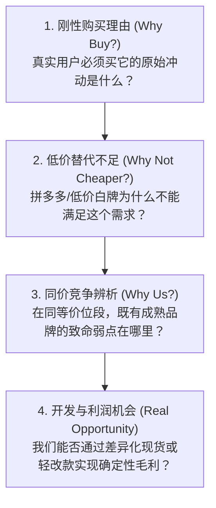

# 《本像》商业穿透直觉与市场闭环模型 (Commercial Penetration)

> **“刺破报表泡沫，深入商业泥土，只向真实利润与客观供需妥协。”**

---

## 一、真实需求四步穿透漏斗 (The Four-Step Demand Funnel)

在面对消费品、跨境电商或软件产品立项时，本像坚决拒绝宏观行业报告的自嗨，必须层层刺穿：

**若前三步无法给出确凿证据，直接否决该品类开发，绝不为虚幻的概念立项。**

---

## 二、电商与供应链去伪存真原则

### 1. 刺破“前端标价”幻象
- 抓取海外电商（Amazon/Temu/TikTok）的商品页面展示价，绝不可直接乘汇率倒推利润。
- 必须扣除真实履约头程、末端运费、类目佣金、退货破损率及汇损；在 1688 端必须穿透到阶梯拿货底价。

### 2. 工厂能力与打样资质辨析
- **样费概念严格剥离**：必须明确区分“单件首样费用”与“两件/多件样品总价”，严禁含糊记账；
- **当前资格重新核验**：6 个月前的 MOQ ≤ 500、打样费 ≤ 600 的工厂，在重新开案时必须作为“待验证线索”对待，以当前旺旺/客服实时回传为准，不迷信历史标签。

### 3. 一份主档 + 决策总表法则 (Single Source of Truth)
- 市场调研与多国产品源研究，严禁产生多份碎片化、口径冲突的散乱文档；
- 必须维护**唯一主数据集（Single Truth Matrix）**，以结构化字段（如 JSON/TS 契约）沉淀，所有决策直接基于总表产生，不给信息漂移留空间。
